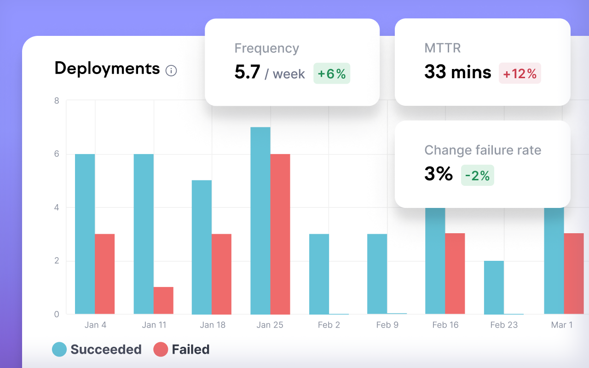

# DORA Metrics




---

## Введение

**DORA (DevOps Research & Assessment)** — это набор из четырёх ключевых метрик производительности инженерных команд.

Они показывают:

- Скорость доставки изменений
- Стабильность продукта
- Эффективность CI/CD
- Зрелость DevOps-культуры

> Это де-факто мировой стандарт, основанный на исследованиях Google.

---

## 1. Deployment Frequency (DF) — Частота деплоймента

Показывает, как часто команда доставляет изменения в продакшн.

Чем чаще небольшие релизы → тем стабильнее и предсказуемее система.

### Категории

| Уровень | Частота релизов |
|---------|-----------------|
| **Elite** | несколько раз в день |
| **High** | раз в день–неделю |
| **Medium** | раз в неделю–месяц |
| **Low** | раз в месяц и реже |

### Формула

```
DF = количество успешных деплоев / период времени
```

**Примечание:** DF не про количество задач, а про количество реальных деплоев.

---

## 2. Lead Time for Changes (LT) — Время от коммита до продакшна

Показывает, сколько времени занимает путь изменения от Git-коммита до успешного деплоя.

### Категории

| Уровень | Время |
|---------|-------|
| **Elite** | < 1 часа |
| **High** | < 1 дня |
| **Medium** | < 1 недели |
| **Low** | > 1 месяца |

### Формула

```
LT = deploy_time - commit_time
```

Рассчитывается по медиане, а не среднему.

**Важно:**

- Это не время разработки фичи
- Это исключительно технический pipeline: commit → build → test → deploy

---

## 3. Change Failure Rate (CFR) — Процент неуспешных изменений

Показывает, какая доля релизов приводит к проблемам, требующим:

- Rollback
- Hotfix
- Аварии
- Деградации SLA

### Категории

| Уровень | CFR |
|---------|-----|
| **Elite** | 0–15% |
| **High/Medium** | 16–30% |
| **Low** | > 46% |

### Формула

```
CFR = (неудачные релизы / общее количество релизов) * 100%
```

---

## 4. Mean Time To Restore (MTTR) — Среднее время восстановления

Показывает, как быстро команда устраняет проблемы в продакшне.

### Категории

| Уровень | MTTR |
|---------|------|
| **Elite** | < 1 часа |
| **High** | < 1 дня |
| **Medium** | дни |
| **Low** | недели |

### Формула

```
MTTR = время устранения инцидентов / количество инцидентов
```

**Что считается "восстановлением":**

- Сервис восстановлен до нормального SLA
- Инцидент закрыт
- Клиентам больше не больно

---

## Сводная таблица по DORA

| Метрика | Что измеряет | Высокий уровень означает |
|---------|--------------|--------------------------|
| **DF** | Скорость доставки | Частые, маленькие, безопасные релизы |
| **LT** | Скорость разработки/поставки | Быстрый CI/CD и короткий цикл feedback |
| **CFR** | Качество релизов | Мало ошибок после деплоя |
| **MTTR** | Устойчивость системы | Быстрое восстановление после инцидентов |

---

## Зачем нужны DORA метрики

- ✅ Объективно измерять эффективность инженеров и процессов
- ✅ Выявлять узкие места (тесты, CI, код-ревью, инфраструктура)
- ✅ Сравнивать себя с индустрией (Google DevOps Benchmark)
- ✅ Обосновывать инвестиции в DevOps: тесты, автоматизацию, мониторинг
- ✅ Строить внутреннюю инженерную платформу (IDP)

> DORA — это не про micromanagement, а про улучшение системы разработки.

---

## Как собирать DORA метрики

Обычно требуется объединить данные из Git + CI/CD + Incident Manager.

### Источники данных

| Источник | Метрика |
|----------|---------|
| Git (commits, PR) | LT |
| CI/CD (deploy logs) | DF, CFR, LT |
| PagerDuty/Jira/StatusPage | MTTR, CFR |
| Observability (Grafana/Datadog) | подтверждение инцидентов |

### Способы автоматизации

- GitHub Actions + GitHub API
- GitLab CI DORA dashboards
- LinearB
- Sleuth
- Harness
- Custom pipeline (ClickHouse/BigQuery + Grafana)

### Пример архитектуры сбора DORA

1. События Git → Kafka / Webhooks
2. Логи CI/CD → ClickHouse
3. Инциденты из Jira/PagerDuty → ClickHouse
4. Метрики агрегируются по часам/дням
5. Дашбординг в Grafana/Metabase

**Результат:** автоматизированная платформа инженерной аналитики.

---

## Интерпретация и анти-паттерны

### ❌ Нельзя

- Использовать DORA для KPI отдельных инженеров
- Накручивать DF "ради метрики"
- Оптимизировать одну метрику ценой другой
- Считать LT по задачам — только по коммитам

### ✅ Нужно

- Смотреть на все метрики вместе
- Разбирать корреляции (например, рост DF может повысить CFR)
- Фиксировать регрессии после изменений в pipeline

---

## Примеры улучшений по метрикам

### Для повышения DF

- Автоматизация деплоймента
- Trunk-based development
- Feature flags

### Для снижения LT

- Ускорение тестов (параллелизация)
- Кеширование сборок
- Уменьшение размера репозиториев/монорепы
- Pre-merge environments

### Для снижения CFR

- Контрактное тестирование
- Canary / blue-green deployment
- Автоматические smoke tests

### Для улучшения MTTR

- Централизованный логгинг
- Алертинг по SLO
- Runbooks / playbooks
- Chaos engineering

---

## Связь с другими практиками

DORA связана с:

- **SRE практиками** — SLO/SLA/Error Budget
- **Accelerate Book** — F. Forsgren, N. Davis, J. Humble
- **Platform Engineering** — внутренние платформы разработки
