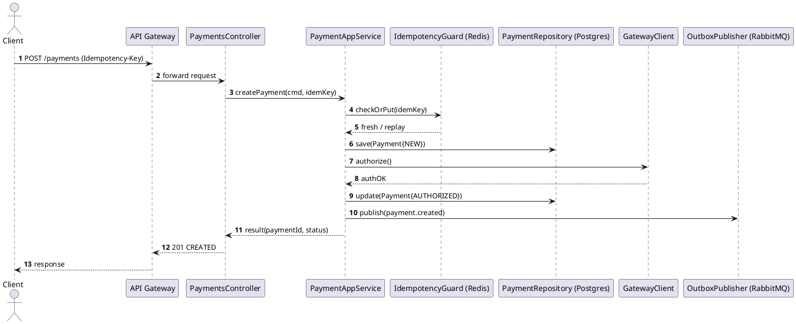

# C4-модель

**C4-модель** — методика визуализации архитектуры программных систем, предложенная Саймоном Брауном.  
Помогает структурировать документацию и показывать архитектуру на разных уровнях детализации — от бизнеса до разработчиков.

**C4 = Context → Containers → Components → Code**

---

## 4 уровня модели

### 1. Context (Контекст)

Самый высокий уровень. Показывает систему целиком и её окружение: пользователи, внешние системы, интеграции.

> *Пример:* «Наше приложение — платформа бронирования. Пользователь работает через веб и мобильное приложение. Система общается с платежным шлюзом и сервисом email».

### 2. Containers (Контейнеры)

Контейнер = крупный развертываемый блок (не обязательно Docker!):
- Веб-приложение
- Мобильное приложение
- База данных
- API-сервис
- Message broker

Диаграмма показывает, какие части системы развернуты отдельно и как они общаются.

### 3. Components (Компоненты)

Внутренняя структура одного контейнера (например, API):
- Сервис авторизации
- Модуль заказов
- Модуль платежей

На этом уровне понятнее для разработчиков, как устроен код.

### 4. Code (Код) — опционально

Самый детализированный уровень:
- Диаграмма классов
- Последовательность вызовов
- Схемы баз данных

Используется для подробной документации внутренностей.

---

## Пример: онлайн-магазин

| Уровень | Содержание |
|---------|------------|
| **Context** | Пользователь → Веб-приложение → Система → Платёжный шлюз, Сервис доставки |
| **Containers** | Frontend (Nuxt), Backend API (NestJS), Database (Postgres), Queue (RabbitMQ) |
| **Components** | UserService, OrderService, PaymentService |
| **Code** | PaymentController, PaymentProcessor |

---

## Примеры диаграмм (PlantUML)

### C1 — Context

Показываем систему целиком, пользователей и внешние зависимости.

```plantuml
@startuml
!includeurl https://raw.githubusercontent.com/plantuml-stdlib/C4-PlantUML/master/C4_Context.puml

LAYOUT_WITH_LEGEND()

Person(user, "Покупатель", "Оплачивает заказ")
System_Boundary(pay, "Платёжная система PayFlow") {
  System(pay_api, "PayFlow API", "REST/JSON", "Принимает платежи, проверяет статус")
}

System_Ext(shop, "Интернет-магазин", "Инициирует платеж")
System_Ext(pg, "Платёжный шлюз", "Эквайринг/3-D Secure")
System_Ext(mail, "Email/SMS провайдер", "Отправка уведомлений")

Rel(user, shop, "Покупает товары")
Rel(shop, pay_api, "Создаёт платёж", "HTTPS")
Rel(pay_api, pg, "Авторизация/капчур", "HTTPS")
Rel(pay_api, mail, "Уведомления о статусе", "HTTPS")
Rel(user, pay_api, "Проверяет статус", "HTTPS")

@enduml
```

### C2 — Containers

Крупные блоки внутри системы и протоколы между ними.

```plantuml
@startuml
!includeurl https://raw.githubusercontent.com/plantuml-stdlib/C4-PlantUML/master/C4_Container.puml

LAYOUT_WITH_LEGEND()

Person(user, "Покупатель")

System_Boundary(pay, "PayFlow") {
  Container(api, "API Gateway", "NestJS", "Публичные REST/GraphQL эндпоинты")
  Container(svc, "Payments Service", "Python/FastAPI", "Бизнес-логика платежей")
  Container(subs, "Subscriptions Service", "Go", "Рекуррентные платежи/биллинг")
  Container(queue, "Message Broker", "RabbitMQ", "События: payment.created, payment.captured")
  ContainerDb(db, "OLTP DB", "PostgreSQL", "Транзакционные данные платежей")
  Container(cache, "Cache", "Redis", "Сессии, idempotency keys, rate-limits")
  Container(ext, "PG Connector", "Node", "Интеграция с платёжным шлюзом")
  Container(notify, "Notifications", "Node", "Email/SMS/Webhook")
  Container(metrics, "Observability", "Prometheus/Grafana", "Метрики/алёрты")
}

Rel(user, api, "HTTP(S)")
Rel(api, svc, "REST/gRPC")
Rel(api, subs, "REST")
Rel(svc, db, "SQL")
Rel(svc, cache, "GET/SET")
Rel(svc, queue, "publish/consume")
Rel(svc, ext, "HTTPS", "Авторизация/капчур/рефанд")
Rel(queue, notify, "consume", "payment.*")
Rel(svc, metrics, "metrics/exporter")
Rel(subs, db, "SQL")
Rel(subs, queue, "publish/consume")
Rel(notify, "Email/SMS Provider", "HTTPS")

@enduml
```

### C3 — Components

Внутренняя структура Payments Service.

```plantuml
@startuml
!includeurl https://raw.githubusercontent.com/plantuml-stdlib/C4-PlantUML/master/C4_Component.puml

LAYOUT_WITH_LEGEND()

Container_Boundary(svc, "Payments Service (FastAPI)") {
  Component(apiCtl, "PaymentsController", "REST", "Создание/получение статуса платежа")
  Component(appSvc, "PaymentAppService", "Service", "Оркестрация сценариев")
  Component(dom, "Domain Model", "Entities/Value Objects", "Payment, Charge, Refund")
  Component(repo, "PaymentRepository", "Repo", "Доступ к БД")
  Component(idemp, "Idempotency Guard", "Lib", "Гарантии идемпотентности")
  Component(outbox, "Outbox Publisher", "Lib", "Надёжная публикация событий")
  Component(pgCli, "GatewayClient", "HTTP", "Интеграция с платёжным шлюзом")
}

ContainerDb(db, "PostgreSQL", "OLTP")
Container(cache, "Redis", "Кэш/idempotency keys")
Container(queue, "RabbitMQ", "События")

Rel(apiCtl, appSvc, "invoke")
Rel(appSvc, dom, "use")
Rel(appSvc, repo, "CRUD")
Rel(appSvc, idemp, "check/store")
Rel(appSvc, pgCli, "authorize/capture/refund")
Rel(outbox, queue, "publish payment.*")
Rel(repo, db, "SQL")
Rel(idemp, cache, "GET/SET")

@enduml
```

### C4 — Sequence (ключевой сценарий)

Последовательность «создание платежа с идемпотентностью и outbox».



---

## Где хранить C4-диаграммы

### В репозитории проекта

- Папка `docs/` или `/architecture/` рядом с кодом
- Диаграммы в PlantUML/Mermaid/Markdown → версионируются в Git
- Автоматически обновляются вместе с кодом

> Подходит, если команда активно развивается и важно, чтобы документация шла вместе с кодом.

### В отдельном knowledge base / wiki

- Confluence, Notion, Obsidian, MkDocs, GitBook
- Диаграммы подключаются через PlantUML-сервер или как картинки

> Подходит для «презентационной ценности» и широкой аудитории.

### Внутри HLD/LLD документов

- **C1/C2** → почти всегда входят в HLD
- **C3/C4** → чаще уносят в LLD (для разработчиков)

---

## Best practices

| Контекст | Рекомендация |
|----------|--------------|
| Командный долгоживущий проект | Держать диаграммы в репозитории + синкать с Wiki (CI рендерит PNG/PDF) |
| Корпоративный проект | Включать в HLD/LLD документы |
| Стартап / быстрый проект | Ограничиться C1–C2 в README/Notion |

---

## Практика хранения по уровням

- **C1–C2** (контекст, контейнеры) → `docs/` + копия в Confluence/Notion
- **C3** (компоненты) → рядом с сервисом (`service/docs/component-diagram.puml`)
- **C4** (код) → реже рисуют руками; генерируют автоматически (Structurizr, Spring Boot plugins)
